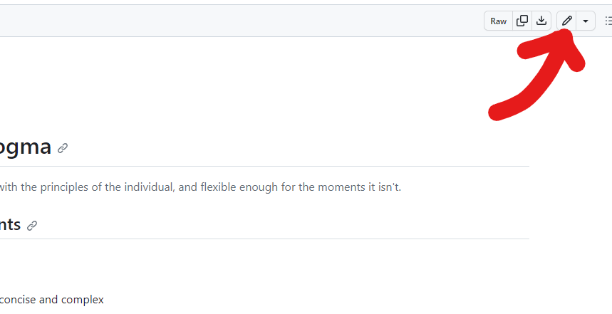
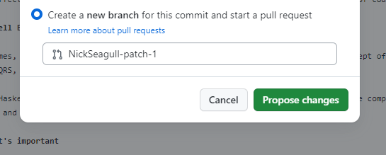
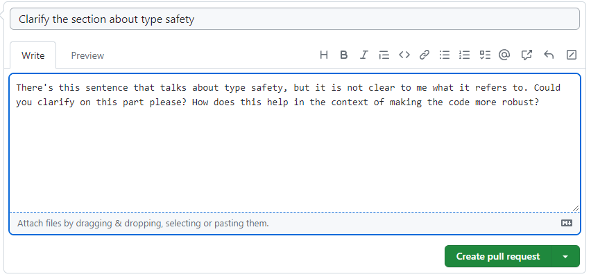

import Badge from '@site/src/components/Badge'

# Note on the Docs

NeoHaskell is an ongoing effort that is yet in an early development stage. Throughout the documentation you might find badges like the following: <Badge issue="57"/>

**Try hovering it!**  (and if you click on it, it will take you to the GitHub issue that's tracking the implementation).

This badge means that this feature is **documented but it is not implemented.** This is on purpose.

We believe that the documentation is the central part of any good
development experience, therefore we first write the documentation, and
only then, we implement the required things to make the feature defined
in the documentation possible.

One of the primary statements of NeoHaskell is:

:::tip If it takes more than 15 minutes to figure out, it is a bug
:::

This doesn't apply only to the command line tool, libraries, and so on, but also **to the documentation itself**.

## Requesting Clarification

If you find yourself reading some part in the documentation and you're having trouble understanding it, click on the
**Edit this page** button on the bottom left of the page, and the GitHub repository with that page will open.

Click on the top right pencil icon to open the editor.



In that editor, mark the part that you find unclear. You can use any kind of marker that you want, as long as it marks well the part you're not clear about. For example:

```text
--->>> some documentation sentence <<<--- rest of documentation....
```

Once you finished, click on the big green button on the top right, select "Create a new branch for this commit and start a pull request" and click on propose changes:



A screen will appear, fill it with the title of your request and some description on what could help you understand this better.



Click on **Create Pull Request**, someone from the contributor team will be notified about this, so the section can be
clarified.

## This is Important

This process helps everyone to maintain a great documentation that everyone can understand, and these are actually the
most important contributions, as when you have experience and knowledge about any topic it is very easy to miss on the
actual details that newcomers can find daunting.


Thanks for reading this part! Now onwards to learn NeoHaskell!
