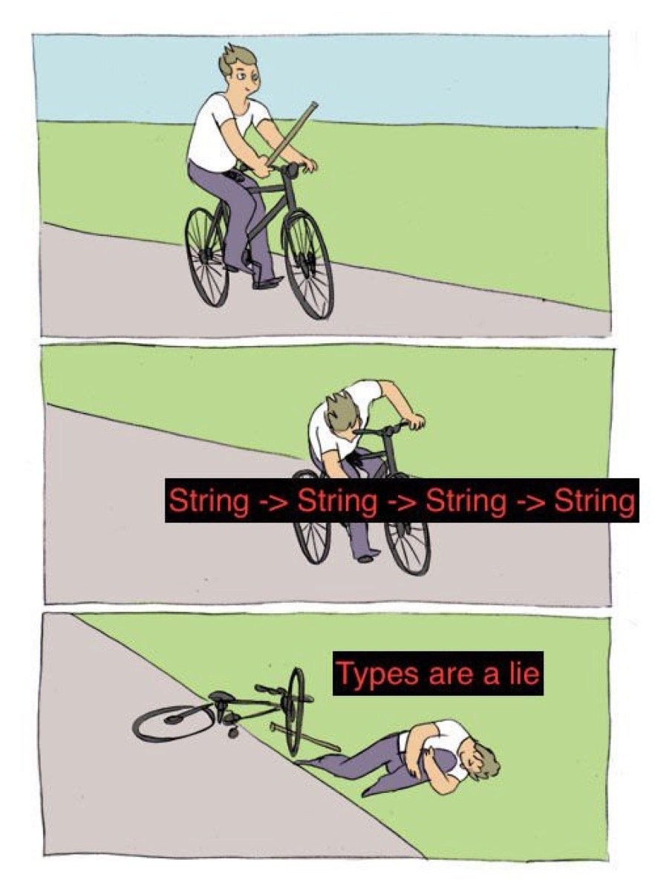

import Tabs from "@theme/Tabs";
import TabItem from "@theme/TabItem";
import Badge from "@site/src/components/Badge";
import Figure from "@site/src/components/Figure";

# Meeting the Types

:::caution
The documentation that you're reading is a design document where most of
the features you're reading are yet to be implemented. Check the [Note on the Docs](/docs/docs-intro)
:::

One of the key features of NeoHaskell is its type system. Some people have preconceived
ideas about types, and they think that they get in the way of development process too
much. This is usually because either the type system of the programming language they
are using is not flexible enough, or that types come as an afterthought of the
development process of their system, like if it is a "necessary bad thing".

In NeoHaskell, types become your best friends. Not only because NeoHaskell's type
system is quite different to type systems from other programming languages (e.g.
it doesn't support inheritance, but supports _super-generics_) but also because
it becomes a very useful design tool for your software development toolbox.

With the NeoHaskell type system, you can sketch an outline of your system, that then
you can fill with the colors of an implementation. If your sketch outlines a dog,
you might color it better or worse, but it will still be a dog.

## Primitive types

In NeoHaskell, you've got the typical primitive types out of the box:

| Type     | Description                      | Example                                    |
| -------- | -------------------------------- | ------------------------------------------ |
| `Int`    | Integer numbers                  | `42`                                       |
| `BigInt` | Big integer numbers              | `1234567890123456789012345678901234567890` |
| `Float`  | Simple precision decimal numbers | `3.1415`                                   |
| `Double` | Double precision decimal numbers | `3.141592653589793`                        |
| `Bool`   | True or False                    | `True`                                     |
| `Char`   | Single characters                | `'a'`                                      |

Of course there are much more many types, but you can consider these as the
most basic ones.

## Annotating Constants

Until now, when we wanted to create a constant, we just assigned a value to a name.
In the NeoHaskell repl, we could do it like so:

```haskell
neo> myConstant = 42
```

In this case, the compiler will automatically _infer_ that the type of `myConstant`
is `Int`. But it could be possible that we want it to be of type `BigInt`, instead of
`Int`.

Given that types are a powerful tool for designing our programs, in NeoHaskell they
get to be on their own line. This means, that for annotating the type of a constant,
we write the type on a line above the assignment line.

We write the type of a constant by using the `::` symbol, which reads as "is of type".

<Tabs>
<TabItem value="neohaskell" label="NeoHaskell">

```haskell
myConstant :: BigInt
myConstant = 42
```

</TabItem>

<TabItem value="ts" label="TypeScript">

```typescript
const myConstant: BigInt = 42;
// Note, `BigInt` does not actually exist in TypeScript
```

</TabItem>
</Tabs>

:::tip
In the NeoHaskell REPL, use the command `:{` to begin writing multiple lines,
use the command `:}` to end the multi-line input.
:::

If we wanted to try this on the REPL, we could do it like so:

```haskell
neo> :{
  myConstant :: BigInt
  myConstant = 42
  :}

neo> myConstant
42
```

## Checking the type of something

In the NeoHaskell REPL, you have a pretty useful command to check the type of stuff,
you can write `:type` and the name of something, and it will tell you the type:

```haskell
neo> :type myConstant
myConstant :: BigInt
```

It replies with "myConstant is of type BigInt".

## Avoiding primitive obsession

There's this concept in software development called "primitive obsession" which
essentially says that using primitive types for everything is bad.

This is because they don't really tell you a story about how your program is
structured, or how your data gets transformed.

A counter-argument that people usually say against "wrapper types", or types whose
only reason of life is to give a name to a primitive type, is that they are not
very efficient. You now would need to have both the primitive value in memory, and
the wrapper that gives the type a name.

In NeoHaskell, you get to create these wrapper types with no performance penalty.

In memory, it is only stored the actual value of the primitive type, but in compilation,
the compiler thinks that it is a different type.

To create a type of this kind, you use the `newtype` keyword and do it this way:

<Tabs>
<TabItem value="neohaskell" label="NeoHaskell">

```haskell
newtype Age = Age Int
```

</TabItem>

<TabItem value="ts" label="TypeScript">

```typescript
// Note: In TypeScript there is no such thing as newtype, so the closest thing
// would be to emulate it with a workaround like the following:
type Age = number & { __tag: "Age" };
const Age = (age: number): Age => age as Age;
```

</TabItem>
</Tabs>

This creates a new type called `Age` whose sole purpose is to be differentiated from
other `Int`s. It also gives us a _constructor function_ called `Age` that we can use to create a
new `Age` value.

To create a constant with this type, you use it's _constructor function_ before the actual `Int` value:

<Tabs>
<TabItem value="neohaskell" label="NeoHaskell">

```haskell
catAge = Age 2
```

</TabItem>

<TabItem value="ts" label="TypeScript">

```typescript
const catAge = Age(2);
```

</TabItem>
</Tabs>

Note how now, you cannot use it as another `Int`:

```haskell
neo> catAge + 4

-- TYPE MISMATCH ----------------------------
Attempting to add two values, but the first value doesn't match the type of the second value:

    catAge + 4
    ^^^^^^

`catAge` is of type:

    Age

But `(+)` needs the 1st argument to be:

    Int

Hint: Maybe try using `cast`?
```

The error message suggests the use of `cast` <Badge issue="80" />, which is a function that allows you to
cast a wrapper type to the type that it wraps, with no performance penalty. We can use
it like so:

```haskell
neo> cast catAge + 4
6
```

In this case, the compiler knows that `catAge` is of type `Age`, and that `4` is of type `Int`,
so it casts `catAge` to `Int` and then adds it to `4`.

### Why do I have to cast it?

The reason for wrapper types is that they not only give names to other types, but also that they
give you a way to differentiate them from the other types. This is useful for when you want to
create functions that only accept a certain subset of types.

It is common that we create a function that accepts many `Int`s as its arguments, but we
want to differentiate them from each other. For example, we could have a function that
accepts a `weight` and a `distance` as arguments, and we want to differentiate them from each
other.

Without wrapper types, we could easily mix them up, making the function call to be
incorrect:

```haskell
neo> :{
  calculateEnergy weight distance = ...
  :}

neo> myWeight = 42
neo> myDistance = 31415
neo> calculateEnergy myDistance myWeight  -- Oops, we mixed them up!
```

To solve this, we could make use of wrapper types, but we also need to know how to specify the types of
the arguments of a function. Let's check that out.

## Annotating Functions

Although the compiler doesn't enforce it, you **should** annotate the types of the arguments. Even more,
the NeoHaskell good practices recommends that you write the type of the function **before** beggining to
write the function's implementation.

> The NeoHaskell good practices recommends that you write the type of the function **before** beggining to
> write the function's implementation.

This is because, as we mentioned earlier, types are a powerful tool for designing our programs, and
they are a great way to communicate the intent of our functions. But this is only true if we ensure that
we have good design pieces to work with, like the wrapper types we just saw.

To annotate the arguments and result types of a function, we write the types of the arguments separated by
arrows like `->`, being the last one the result type. For example, if we wanted to annotate the
`calculateEnergy` function, we could do it like so:

<Tabs>
<TabItem value="neohaskell" label="NeoHaskell">

```haskell
calculateEnergy :: Int -> Int -> Int
calculateEnergy weight distance = ...
```

</TabItem>

<TabItem value="ts" label="TypeScript">

```typescript
const calculateEnergy = (weight: number, distance: number): number => ...
```

</TabItem>
</Tabs>

:::note

It is common that newcomers find it weird that there's no separation between the arguments and the result type,
like with a parenthesis or something. This is because it is very useful for a thing called _partial application_,
which we will see in future sections.

:::

Note how the `calculateEnergy` function accepts two `Int`s as arguments, and returns an `Int` as a result. But we
still have the problem of mixing up the arguments, so let's fix that.



A good way of measuring whether a type annotation is good or not, is to check if it is possible to figure out the
implementation of the function just by looking at the type annotation. In this case, we can't, because we don't
know which argument is which, neither if we need to pass `weight`, `distance` or even maybe some other `Int` that
we don't know about.

Given that weight and distance are two units that probably make sense in our domain, we can create wrapper types
for them:

<Tabs>
<TabItem value="neohaskell" label="NeoHaskell">

```haskell
newtype Weight = Weight Int
newtype Distance = Distance Int
```

</TabItem>

<TabItem value="ts" label="TypeScript">

```typescript
type Weight = number & { __tag: "Weight" };
const Weight = (weight: number): Weight => weight as Weight;

type Distance = number & { __tag: "Distance" };
const Distance = (distance: number): Distance => distance as Distance;
```

</TabItem>
</Tabs>

Now, we can use these wrapper types to annotate the arguments of the `calculateEnergy` function:

<Tabs>
<TabItem value="neohaskell" label="NeoHaskell">

```haskell
calculateEnergy :: Weight -> Distance -> Int
calculateEnergy weight distance = ...
```

</TabItem>

<TabItem value="ts" label="TypeScript">

```typescript
const calculateEnergy = (weight: Weight, distance: Distance): number => ...
```

</TabItem>
</Tabs>

Now it is much better, but we can improve it even more. Is the weight in kilograms? In pounds? In grams? Is the
distance in meters? In kilometers? In miles? In light years? We don't know, and we can't know just by looking at
the type annotation. Also, we have no clue about the result type, is it in joules? In calories? In kilocalories?

Let's fix that by creating more wrapper types, and changing the type annotation of the function:

<Tabs>
<TabItem value="neohaskell" label="NeoHaskell">

```haskell
newtype Kilograms = Kilograms Int
newtype Meters = Meters Int
newtype Joules = Joules Int

calculateEnergy :: Kilograms -> Meters -> Joules
calculateEnergy weight distance = ...
```

</TabItem>

<TabItem value="ts" label="TypeScript">

```typescript
type Kilograms = number & { __tag: "Kilograms" };
const Kilograms = (weight: number): Kilograms => weight as Kilograms;

type Meters = number & { __tag: "Meters" };
const Meters = (distance: number): Meters => distance as Meters;

type Joules = number & { __tag: "Joules" };
const Joules = (energy: number): Joules => energy as Joules;

const calculateEnergy = (weight: Kilograms, distance: Meters): Joules => ...
```

</TabItem>
</Tabs>

This is much better, if we take a quick glance at the type annotation, it is very clear what the function does,
and what it expects as arguments and what it returns as a result.

```haskell
calculateEnergy :: Kilograms -> Meters -> Joules
```

We haven't looked at the implementation, and it really doesn't matter, because there's a **contract** that has been
specified for this function. It is a contract that we can trust, because it is enforced by the compiler.

And remember! Functions in NeoHaskell cannot fail, so if you see a function that returns a `Joules`, you can be
sure that it will return a `Joules` value **always**, and it will never crash.

This is the true power of types, they are a powerful tool for designing our programs, and they are a great way to
remove the need of having to read the implementation of a function to understand what it does.

## Conclusion

In this section, we've seen how to annotate the types of constants and functions, and how to create wrapper types
to avoid primitive obsession.

We have dipped our toes into what they call [Domain Driven Design](https://en.wikipedia.org/wiki/Domain-driven_design)
or DDD, which is the way of designing software that NeoHaskell inspires from.

NeoHaskell's way of approaching software development is very different to other programming languages, because it makes
you think about the design of your program before you even start writing it. At first, it might seem like a lot of work,
but in exchange, you get tools that make your life easier, and your head free of worries.
