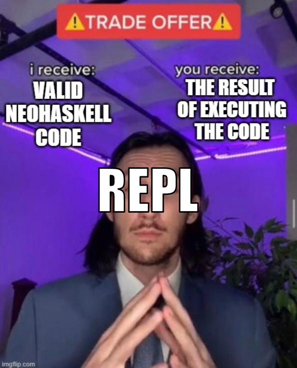

import Tabs from "@theme/Tabs";
import TabItem from "@theme/TabItem";
import Badge from "@site/src/components/Badge";

# Interactive Console

:::caution
The documentation that you're reading is a design document where most of
the features you're reading are yet to be implemented. Check the [Note on the Docs](/docs/docs-intro)
:::

Even though NeoHaskell is a compiled language, it provides an interpreted
mode which is much faster for the development process. In any moment, you
can run `neo run:repl` and it will start an interactive console where you
can checkout small pieces of NeoHaskell code. <Badge issue="71"/>



When you run the command, it will start, what's called in programmer jargon,
a REPL (Read-Eval-Print-Loop). A REPL will do the following algorithm:

1. **Read** the code you wrote
2. **Evaluate** (execute) it
3. **Print** the result
4. **Loop** back to 1

Let's fire up `neo run:repl`:

```text
neo>
```

This is the prompt of the REPL. It's waiting for you to write some code. Let's write our first hello world program!

```text
neo> print "Hello World!"
Hello World!
```

Awesome, we've completed our first hello world program under a minute. Let's try doing some math: <Badge issue="22"/>

```text
neo> 1 + 1
2

neo> 2 * 2
4

neo> 7 ^ 20
79792266297612001
```

Whoops, the last number is a bit too big.
This is because `^` is the exponentiation operator.
It's the same as writing $7^{20}$ in math.

Anyway, to quit the REPL, you can press `Ctrl + C` or write `:quit`.

## Exploring the REPL commands

At any time, you can write `:help` to see the list of commands available.

Don't worry too much about them if they
seem a bit overwhelming. You'll learn them as you go.
