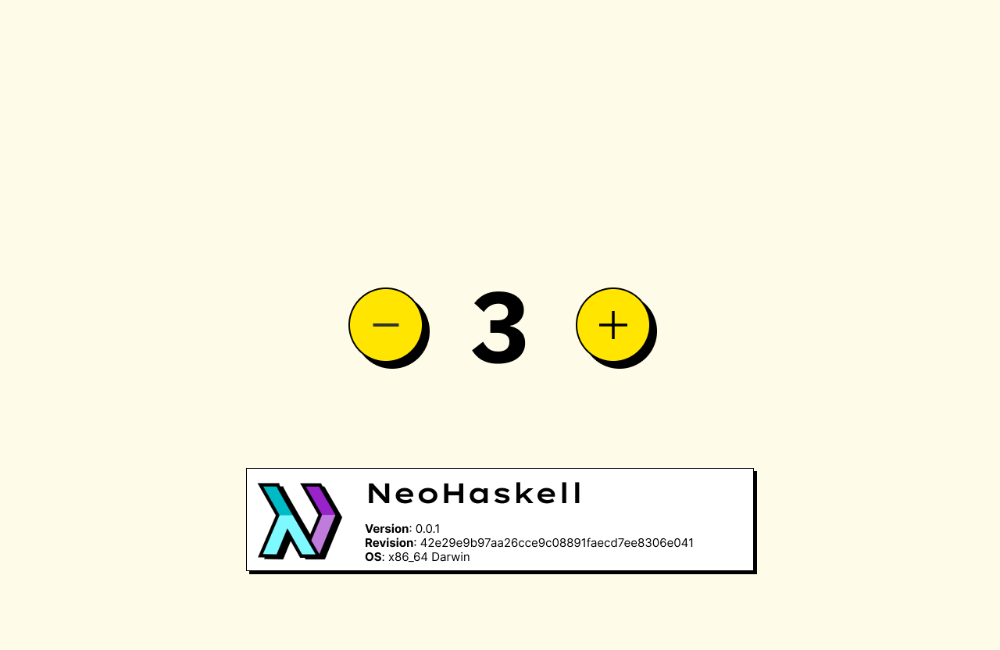

import Tabs from "@theme/Tabs";
import TabItem from "@theme/TabItem";

# Hello, Neo!

## Running the Web Server

Right from the creation moment of the project, your NeoHaskell application is set up and ready to be launched. By default,
it is configured to run a webserver on port `3000`. Run the following command in your terminal:

```bash
$ neo run:app
```

This will activate the NeoHaskell web server. Open your browser and navigate to `http://localhost:3000` to view your application's default landing page.

Try playing with the buttons, it is a working Counter application!



To stop the server, press `Ctrl+C` in the terminal.

## Implementing a Simple Greeting Feature

In NeoHaskell, instead of using technical concepts like routes, views, models, and controllers, you work with the concept of **entities** and their different interactions in the domain of your application. The domain is the set of concepts that revolve around the problem you are trying to solve with your application.

> The domain is the set of concepts that revolve around the problem you are trying to solve with your application.

For example, if you are building a blog application, the domain of your application will be composed of concepts like **posts, comments, and users**. If you are building a chat application, the domain of your application will be composed of concepts like **users, rooms, and messages.**

We call these concepts **entities**.

To create a basic greeting feature in your application, we will need to create a new Message entity. In order to do so,
you will need to run the following command in your terminal:

```bash
$ neo new:entity Message
```

This will create a new Message entity in your application. The entity components, will be created in the `src/Message` directory, and the entity configuration will be added to the `src/Message.hs` file.

Let's modify the view of the Message entity to display a greeting message. Open the `src/Message/Views.hs` file and modify the `view` function so it looks like this:

:::info

Throughout the docs, you will see **tabs like the ones below**. They are used to show how would the **NeoHaskell** code would look in **TypeScript**, so it is easier for you to find anchors to accelerate your learning process.

:::

<Tabs>
  <TabItem value="NeoHaskell">

```haskell
view :: ViewModel -> View Html
view _ = do
  let messageHtml = h1 [style "color: red;"]
                       [text "Hello, NeoHaskell!"]
  render messageHtml
```

  </TabItem>
  <TabItem value="TypeScript">

```tsx
const view = (_: ViewModel): View<Html> => {
  const messageHtml = (
    <h1 style="color: red;">
      Hello, NeoHaskell!
    </h1>
  )
  return render(messageHtml)
}
```

  </TabItem>
</Tabs>

Note how we use a [DSL (Domain Specific Language)](https://en.wikipedia.org/wiki/Domain-specific_language) to define the HTML that the `view` function returns. Instead of using JSX, which is HTML with interpolation, we use a DSL that is more suited for the task of defining HTML in a functional way.

1. **Edit the Counter Entity:**
   Open `src/Counter.hs` and configure the Counter entity to respond with a "Hello, NeoHaskell!" message.

2. **Modify the State and View:**
   - In `src/Counter/State.hs`, update the state management to reflect the "Hello" feature.
   - In `src/Counter/Views.hs`, define a view function that outputs "Hello, NeoHaskell!".

3. **Test the Feature:**
   Restart the NeoHaskell server and navigate to the appropriate URL (e.g., `http://localhost:3000/counter`) to see the "Hello, NeoHaskell!" message displayed.

4.3 Configuring the Application's Home Page

To set the "Hello, NeoHaskell!" feature as the default response at your application's root URL (`http://localhost:3000`), make the necessary adjustments in the `Counter` entity's configuration in `src/Counter.hs`. This ensures that the root path interacts directly with the Counter entity, displaying the greeting message.